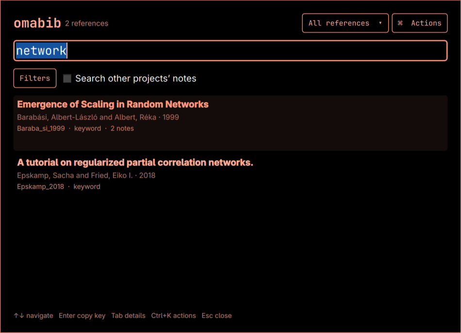

# Verification: Omabib 0.1.0

## Inline AlphaXiv Markdown (2026-09-14)

The AI Overview button now renders the cached Markdown report as read-only, selectable rich text in the reference detail pane. The report uses the pane's main scroll instead of a fixed-height nested text box. The installed popup was visually inspected with a 13,834-character cached AlphaXiv report: headings, emphasis, and lists rendered correctly. Plugin validation passed, and the previous hidden GRL selection and open overview state were restored after the shell reload. No library record changed.

## Open Zathura's reference with Super+B (2026-09-14)

Super+B now reads the focused Zathura window's D-Bus PDF path and resolves that exact canonical path through Omabib's attachment index. The popup opens the matched citation key in All references with its detail pane expanded. Outside Zathura, Super+B retains the normal toggle. A missing or ambiguous attachment gives a notification and opens ordinary search. The installed command and popup passed an isolated live test with two references attached to different PDFs named `paper.pdf`, a prior project filter, repeated invocation, and non-Zathura toggling. The shell was restarted to load the changed QML. No fixture entered the real library.

## Project selector and AlphaXiv overview (2026-09-14)

The top project selector now sends both `project_filter` and `project_id`. Switching scope preserves search text; an expanded reference outside the new project closes back to search, while a reference still included remains open. The detail pane's Assign button opens a separate target picker from All references or any project. The assignment and subsequent filtered search were verified against an isolated service and temporary library.

The AlphaXiv AI Overview button fetches first-party overview Markdown on demand through a separate service connection, caches it by reference ID, and displays it in the detail pane with source attribution. Cached text is included in database backups and history snapshots. The isolated live test verified first fetch, cache hit, exported Markdown, and rendered popup display. It also inspected the rendered project selector and overview panel. No test references or summaries were written to the real library. Rust tests and Clippy passed; the installed plugin validated and the real service remained active.

## Compact selection-first notes (2026-09-14)

Super+N now validates Zathura, then selects a region before showing the editor. A point selection opens a text-only note; a rectangle opens a PNG draft. The popup is 440 logical pixels wide, 260 high for text or 410 for an image, with theme colors, an opaque background, title/page context, commentary and project selection. The rendered image popup was inspected after its opening animation.

The full existing Rust suite passed, plus a new exact-path lookup test covering symlink canonicalization, same-basename rejection and ambiguous attachment rejection (38 tests total). Clippy with warnings denied and the release build passed. Live isolated-library checks passed for saved images, cancellation, real slurp Escape, filename recovery without remembered context, switching the popup back from a different service socket, and selection-first point/image drafts through the installed helper. Rectangle/point coordinates were supplied at the mouse-selection boundary; physical mouse dragging/clicking was not automated. No test notes were added to the real library.

## Visual notes (2026-09-14)

Super+N opens the verified Zathura reference and page context. The rectangle action hides the popup, runs slurp and grim, previews the PNG, and saves optional commentary with the image. Capture checks the same PDF, page, window and rectangle bounds. Picker stdin is closed explicitly so it cannot wait on the popup process before showing its overlay.

`cargo test --locked --offline` passed all 37 tests; Clippy with warnings denied and the release build passed. Visual-note coverage includes project isolation, atomic rollback on invalid images, image-only notes, retained images after commentary edits, idempotent retries after staging-file removal, and SQLite backups.

`OMABIB_TEST_VISUAL=1 python scripts/test_quick_note_ui.py` passed against an isolated temporary library: fixed reference/project/page targeting, real grim capture with supplied rectangle coordinates, image-only save, identical PNG bytes through the actual MCP image response and history export, draft-file cleanup, real slurp Escape cancellation with editor restoration, and rejection of another PDF with the same basename. Mouse dragging itself was not automated. The final quick-note invocation opened the editor in 360 ms including CLI startup and polling. The real library was restored without adding test notes. Installed plugin validation and source/install comparisons passed.

## Date-added browsing (2026-09-14)

Blank-query browsing reads `refs` in indexed `created_at DESC, id DESC` order when the popup's default newest-added sort is selected. Citation-key order remains available. On a consistent copy of the 102,010-reference synthetic fixture, 25 repeated 25-item requests had a newest-added backend p95 of 1.05 ms and socket round-trip p95 of 4.52 ms; citation-key browsing measured 1.00 ms and 4.41 ms, respectively. `EXPLAIN QUERY PLAN` showed `SCAN refs USING INDEX refs_added`. Copying the fixture and initial index creation were outside these request timings. Library tests cover ordering, pagination, filters, relevance ranking for nonblank queries, and adding the index when opening an older database.

Measured on 2026-09-13 on this Omarchy desktop: AMD Ryzen 5 5500U, 12 logical CPUs, Quickshell 0.3.1, Rust 1.98.1, 1920×1080 display at approximately 60 Hz and 1.25 scale. The desktop remained in normal use during testing.

## Performance

The scale fixture began with 100,000 references and 300,000 notes. Repeated import checks added records: the final backend benchmark began with 101,010 references and ended with 102,010. UI measurements used that resulting library. Fixture text combines 20 research topics, 10 methods and 10,000 author identities with synthetic abstracts and contextual notes. This establishes scale behavior, not real-library relevance.

| Measurement | Result | Initial target |
|---|---:|---:|
| Warm backend query p95, range across 11 queries | 3.2–18.5 ms | ≤25 ms |
| Ordinary query change to rendered frame, p95 | 46 ms | ≤50 ms |
| Typo query change to rendered frame, p95 | 30 ms | ≤100 ms |
| Warm popup open to rendered frame, p95 | 36 ms | ≤100 ms |
| First popup after shell restart, one observation | 60 ms | Not a login benchmark |
| Service socket ready, including process launch | 101 ms | No separate target |
| Import 1,000 new references through public API | 2.01 s | No separate target |
| Search during import, wall p95 | 17.7 ms | No separate target |
| 44 queries across four concurrent readers | 167 ms total | No separate target |
| Resident service memory before import | 73 MiB | No separate target |
| Database file after fixture creation | 1.46 GiB | No separate target |
| Synthetic seed plus full index construction | 126.6 s | No separate target |

The seed uses bulk SQL followed by index rebuilds. It is not the public BibTeX importer. Import throughput is measured separately with 1,000 previously unseen citation keys and includes vocabulary refresh.

The UI uses `QQuickWindow.frameSwapped` to measure a rendered frame after the result model changes. Twenty ordinary queries, twenty typo queries and twenty window openings were measured. Query changes were sent through a diagnostic IPC method into the normal search-field property and debounce path. Physical keyboard delivery and monitor scanout are outside that measurement. The external command/poll harness observed readiness at 103 ms p95, which includes CLI startup and polling overhead.

First opening immediately after login was not tested because that would require interrupting the user's session. A single opening after restarting the shell measured 60 ms; it is not a substitute for a cold-login acceptance test.

Raw results: [backend](verification/backend.json), [rendered UI](verification/ui-timing.json), [keyboard smoke test](verification/keyboard.json).

## Correctness checks completed

`cargo test --locked`: eight behavioral tests pass. `cargo clippy --all-targets -- -D warnings`: clean. Release build succeeds.

The tests cover accent/LaTeX normalization, prefixes, substrings, one-edit transpositions, mixed-field and abstract matches, phrases and malformed punctuation; BibTeX macros, corporate authors, books, unknown fields and dependent exports; title capitalization and journal field export; DOI and citation-key collisions; note scope, cross-project opt-in, revisions and duplicate retry protection; ambiguous project roots, bounded context and missing attachment paths.

Live DOI lookups also passed, including a record with a spelled-out month. An existing title conflict appeared in the preview without changing the stored metadata.

Two real DOI records are checked in under `tests/fixtures/networks.bib`. Curated author/title searches find their intended record first. This small fixture does not establish recall or ranking quality on a diverse personal library.

`scripts/test_transport.py` passes against the release executable. It checks actual concurrent socket writes, one successful update in a stale-revision race, duplicate-service rejection, MCP initialization/discovery/search, backup and CLI restore preserving IDs and note history, refusal to overwrite a restore target, private restored-file permissions, and recovery after killing the service during an import with uncommitted WAL writes. Previously committed notes survive and none of the interrupted import's references appear.

Live keyboard checks passed for initial focus, result search, Tab details, Ctrl+K actions, Escape dismissal and Enter citation copying. A note was also saved through the editor, although concurrent desktop typing made its exact-text test inconclusive. Backend note persistence and conflict tests pass independently. The final popup was visually inspected using the current Omarchy theme. A full keyboard traversal of every dialog and live switching between themes remain manual acceptance checks.

The installed plugin validates, the user service is enabled and active, Codex's local stdio MCP registration is present, and Hyprland reports no configuration errors. Super+B is registered for Omabib. The production library contains no benchmark or test records.

## Design limits

Search ranks a bounded indexed candidate set with a separate title/author/key pass. It does not exhaustively sort every possible match. Broad queries may require narrowing, which the UI indicates. Lexical and typo retrieval do not provide conceptual similarity.

Automatic duplicate identity uses DOI and compatible citation keys. Other identifiers are retained and searchable; arbitrary identifier-based record merging is not implemented. Existing conflicting metadata remains unchanged and is reported for explicit editing.

Schema 1 is the initial format. There is no older released schema to migrate. Newer schema versions are rejected; future upgrade migrations must make a backup before modifying an existing library.

Cloud ChatGPT connectivity, automatic multi-computer metadata merging, full-PDF indexing, semantic embeddings and PDF reading/annotation remain outside v1. Explicit Git history export and PDF download/recovery are supported.

## Numbered actions and bar integration

The follow-up UI adds actions 1–14, a themed in-popup BibTeX file browser, and a book icon containing the Omarchy glyph in the left bar. Live checks verified one- and two-digit shortcuts, file-browser cancellation, and importing a filename containing spaces into an isolated library. The initial Qt native chooser crashed Quickshell and was replaced by the in-popup browser. The final implementation imported successfully without restarting the shell. The normal library remained empty. See [UI action checks](verification/ui-actions.json).

## Automatic import repairs

Eleven library tests pass after adding duplicate-key consolidation, identical-entry consolidation, duplicate-field repair, missing-field-comma repair and BOM handling. Tests verify combining complementary metadata, conflict reporting, preservation of notes on reimport, distinct DOI separation, and avoiding incorrect merges when an incoming key collides with an existing reference. Malformed unclosed entries still fail atomically. Clippy is clean and the socket/MCP, backup and interrupted-import regression suite passes with the release build.

## Repository sync and PDF attachments

Twelve library tests pass, and Clippy is clean. The isolated history integration test verifies repository configuration, snapshot/push, PDF LFS pointers, recovery after deleting both the original PDF and local LFS object cache, attachment removal preserving the file, actual MCP attachment creation, HTTPS PDF download, and refusal to overwrite edited history metadata. The transport, revision, retry, backup and interrupted-import regression suite passes.

The installed interface was checked with real keyboard input. Action 16 opens populated repository settings; action 15 completes the configured GitHub push. Action 9 opens the PDF browser, and a filename containing spaces attaches successfully to the selected reference and appears in its refreshed detail view. Test attachments were confined to a temporary library. Repository and detail layouts were visually inspected.

The production sync reports 1,583 references, zero notes, zero archived PDFs, an unchanged commit and a successful push. The checkout is clean with zero divergence from origin/main. The service is active. Sync exports and pushes local metadata; it does not merge remote metadata into SQLite. Existing MCP sessions need reconnection to discover the three new PDF tools.

## Enter targets and online metadata

Seventeen tests pass (15 library tests and two provider/ranking unit tests), with clean Clippy. New checks cover PDF/URL/DOI target priority, missing attachment fallback, missing target errors, revision-safe and retry-safe enrichment, unchanged notes/keys/existing fields, BibTeX serialization, immediately searchable filled abstracts, provider mapping and original-paper ranking above commentary.

Live isolated gateway checks pass for Crossref DOI lookup, title-only DOI discovery, DataCite arXiv lookup and Europe PMC abstract supplementation. The returned abstracts contained 716, 1,276 and 1,136 characters for the three fixture references. Tests apply metadata only to temporary libraries.

Installed desktop checks pass for action 17, preview display, Ctrl+Enter application and Enter opening the reference link and dismissing the popup. Existing key copying is retained as action 1. The production library was not enriched during testing. Online retrieval is an explicit operation, and title-search candidates require review.

The final plain-text preview was visually verified after constraining its scroll viewport; long abstracts no longer paint over the title or action buttons. Production status remains 1,583 references and zero notes, with the service active.

## Magic add, abstract enrichment, storage wizard, sync status, and PDF access

Thirty-four tests pass: 12 unit tests (`abstracts`, `ingest`, `attachments`, `metadata`) and 22 library integration tests, with clean Clippy. New unit tests cover arXiv ID recognition (new/old/URL/`arXiv:` forms), DOI recognition, identifier splitting, `family_word_year` citation keys, the abstract chain's OpenAlex/Semantic Scholar/Europe PMC parsing and longest-wins/stop-at-threshold logic, PDF-URL scheme rejection, and PDF filename sanitizing. New library tests cover `pdf_path`/`has_pdf`/`has_abstract` reflecting attachments and abstracts correctly, `get_pdf` returning a local attachment without network and refusing when none exists and downloads are disabled, and `add_reference` end-to-end from BibTeX: attaching a PDF and linking a project inside one transaction, idempotent retry returning the identical cached result, rejecting a reused key with different content, requiring `input` or `pdf_path`, and — checked directly — writing nothing at all when attaching an unreadable `pdf_path` fails partway through.

`scripts/test_transport.py` and the extended `scripts/test_history_integration.py` pass against an isolated service and a local bare Git remote. New checks cover `repo_check` reporting installed tools and a candidate path's state (including missing Git LFS tracking) without a repository configured; `repo_setup`'s `local` mode refusing a checkout without LFS tracking until `fix_lfs` is set, then configuring it; `repo_status` reporting configuration, zero ahead/behind, and pending changes appearing after a note is added post-sync; and a genuinely diverged remote (a second clone pushes first) causing `sync_repo` to return `ok:false` with the local commit still made (`committed:true`) and `repo_status().last_error.kind` reporting `"diverged"`.

Live, network-dependent checks (temporary libraries only) verified: `add_reference` for an arXiv ID fetched an abstract and downloaded a citekey-named PDF (`vaswani_attention_2017.pdf`, confirmed to start with `%PDF-`); `add_reference` for an Elsevier DOI (`10.1016/j.chbah.2026.100296`) filled an abstract via OpenAlex, which Crossref and DataCite do not carry for it; retrying the same `idempotency_key` returned the identical cached result; a URL with no DOI/arXiv pattern in the URL string itself (a Frontiers article page) still resolved, through either an inferred DOI or the page's own `citation_*` metadata; a comma-separated multi-identifier paste (`preview_entry`) produced one item per identifier, correctly typed; `get_pdf` returned the just-downloaded local copy without a new request, and `identify_pdf` on that same file found a DOI/arXiv-ID pattern or (title-search fallback) a title containing "Attention"; the stdio MCP adapter's `tools/list` reported exactly 12 tools including `add_reference` and `get_pdf`, and both worked through `tools/call`; `omabib enrich --abstracts --limit 3` against three freshly imported DOI-only references filled 2 of 3 (via Semantic Scholar and OpenAlex; the third had no abstract available anywhere checked), matching abstract availability independently confirmed for those DOIs via direct API calls beforehand.

An earlier version of the abstract-enrichment code left `abstract_source` unset whenever Crossref or DataCite's own record already carried the abstract (only setting it when the separate OpenAlex/Semantic Scholar/Europe PMC chain had to add one) — caught by the arXiv `add_reference` check above, since DataCite supplies that paper's abstract directly. Fixed so the primary gateway is reported as the source in that case too.

An earlier version of `omabib enrich` listed references missing an abstract via a direct SQLite read at a guessed path (`OMABIB_DB`, defaulting to the production library) rather than through the running service's own connection, so an isolated test service reachable only via `OMABIB_SOCKET` could silently list a different library than the one its RPC calls then operated on. Caught because the backfill filled zero of three references it should have filled in an isolated test. **The production library was not affected**: checked directly afterward — still exactly 1,584 references, and the most recently `updated_at` timestamp across all references was from 2026-09-13, before this change was made, with nothing from the day of this fix. The RPC calls in the failing run simply errored ("reference not found") against the mismatched database rather than writing anywhere. Fixed with a new `missing_abstracts` service-side operation that always lists from the exact database the service itself is running.

`omarchy plugin validate plugin` passes. `qmllint` was tried against the modified `plugin/App.qml`; its output (a silent non-zero exit) was identical before and after this round of changes, which also reproduces on the pre-existing unmodified file, so it reflects a limitation of running `qmllint` on a Quickshell-dependent file outside a Quickshell environment, not a defect introduced here. A brace/paren/bracket balance check and manual review of the diff found no imbalance or obvious error. The updated UI (search-field magic add, quick-add preview showing abstract/PDF status per item and calling `add_reference` for a single recognized identifier, the sync status chip, the repository setup dialog's live prerequisite checks and two setup paths, and the Get PDF/Copy PDF path actions) has **not** been exercised with live keyboard input against the running desktop this round — doing so would take over the user's keyboard via `wtype`, which needs their go-ahead first (as `scripts/test_ui.py` itself already notes, "should run while no one else is typing").

The production library was not modified during any of this round's testing: reference count checked at 1,584 both before this work began and after it concluded, and no `updated_at` timestamp from today was found.

## Reference and individual-note deletion

The reference detail view now offers **Delete item…** (also Ctrl+K action 21), and each note in that view offers **Delete…** beside Edit. Both require a preview and confirmation. Reference deletion removes its notes, image clips, attachment and project links, cached overview, and search rows in one transaction. Individual-note deletion removes only that note, its image clip, revisions, and search row. PDF files remain on disk. MCP exposes read-only previews and the two destructive operations, with revision and identity checks plus idempotent retries.

`cargo test --locked` passed (14 unit, 26 library, and 2 visual tests), as did `cargo clippy --locked --all-targets -- -D warnings` and `git diff --check`. The library tests verify stale-preview rejection, idempotent retries, child-row and FTS cleanup, other-reference and other-note preservation, and PDF-file preservation. `scripts/test_transport.py` passed against the release executable, including actual stdio MCP discovery and note/reference deletion through `tools/call` in an isolated library.

After installation and shell restart, `scripts/test_delete_ui.py` passed against an isolated service. It opened both confirmation dialogs in the running Omabib popup, cancelled each with Escape, deleted one of two notes with Ctrl+Enter, then deleted the reference with Ctrl+Enter. It verified search cleanup and the retained PDF file. Both dialogs were visually inspected in the installed theme. The normal window was restored to its prior hidden search state. The installed plugin validates and the user service is active. No production reference or note was deleted during testing.

## Codex entry chat

The detail-view Codex button and action 22 launch a separate terminal with a private context snapshot, all paginated notes with project labels, exported image clips, PDF paths, and a per-session Omabib MCP connection to the originating library. `scripts/test_codex.py` passed against an isolated service with 28 notes, a visual clip, and a PDF filename containing spaces and shell metacharacters. It verifies exact image bytes, private file permissions, the actual Codex MCP configuration, and the explicit `gpt-5.6-sol` model with medium reasoning.

The installed popup launched and focused a new Ghostty window. After the normal first-use directory trust prompt, Codex read the context file, successfully called Omabib `get_reference` for the temporary fixture, and acknowledged its note before waiting for input. This live chat used the prior inherited model; the subsequent Sol/medium change was verified in the launcher test and installed without running another model response. The temporary chat and service were closed, and the normal hidden library view was restored. Production status remained 1,592 references and 5 notes.

## ChatGPT Desktop entry handoff

The installed ChatGPT button opens Desktop's Codex mode with a prefilled, unsent Omabib prompt. Its stable Omabib project has a local Omabib skill, an MCP configuration for the originating service socket, and a private snapshot per entry. `scripts/test_codex.py` verifies the generated mode, context, skill, MCP socket, model and effort. In the live DYNAMITE handoff, the draft displayed **GPT-5.6 Sol Medium**. Desktop's Work mode retained its previously selected Astra model despite the workspace config; only Codex mode is supported for the Omabib Desktop button.

## UI redesign: rail, tabs, AI summary renderer (2026-09-15)

The popup was rebuilt from one 1,272-line `App.qml` into `App.qml` (state, RPC, IPC, dialogs) plus presentational components in `plugin/components/`. `scripts/install.sh` now replaces that directory as a whole.

- **Rust:** `cargo test --locked` passes (45 tests, including the `view` filter, `has_overview`, `get_reference` projects/`created_at`, and the relaxed alphaXiv overview check). `cargo clippy --all-targets -- -D warnings` is clean.
- **Renderer:** `node scripts/test_overview_text.js` passes (10 tests) on both real alphaXiv shapes: `# Research Report:` with `##` sections, and a prose opening with `###` sections and nested bullets (2609.05993). Both yield six sections.
- **Offscreen QML:** `tests/qml/tst_foundation.qml` and `tests/qml/tst_panes.qml` pass under `qmltestrunner` (12 pane tests: every tab, loading/unavailable states, the overflow menu, palette filtering and numbered actions, empty states). Screenshots were compared against the approved mockup.
- **Static:** `omarchy plugin validate plugin` passes. `qmllint` on `App.qml` reports only unqualified-access style warnings and Quickshell type-registration limits.
- **Installed:** after `./scripts/install.sh`, the shell kept serving the previously compiled `App.qml` through `rescanPlugins` and a plugin disable/enable; `omarchy restart shell` loaded the new version with no QML errors in the shell log. The popup opened on the real library in compact and three-pane layouts, and the AI summary loaded a 16,030-character cached overview through `selectTab ai`.
- **alphaXiv fix:** `get_alphaxiv_overview` for 2609.05993 had failed with "AlphaXiv did not return an AI overview" because the report opens with prose rather than a title. After the fix it returns `available: true` and caches the 19,209-character report; search now flags the paper `has_overview`.
- **Not run:** the wtype-driven live tests (`scripts/test_ui.py`, `scripts/test_tabs_ui.py` and the other `*_ui.py` scripts) were not run this round, because the desktop was in active use and they take over the keyboard.

## Settings panel, Claude handoffs, selectable reading text (2026-09-15)

- **Settings:** `scripts/test_claude.py ~/.local/bin/omabib` passes against an isolated service and temporary XDG directories. It checks the Claude Code command (context folder, private `mcp.json` for this library's socket, session name, shared prompt), the Claude Desktop `claude://claude.ai/new?q=` link and prompt, settings validation, PDF-viewer discovery from desktop entries (actions ignored, uninstalled programs skipped), and Claude Desktop registration merging into an existing config with its permissions and a one-time backup. `scripts/test_codex.py` still passes.
- **Offscreen QML:** 19 tests pass. New ones select the whole AI summary across blocks, drag-select without scrolling the pane, jump to the last section from the strip, select the abstract, and choose settings in `SettingsPanel` (an uninstalled app can't be chosen).
- **Renderer:** 11 node tests pass, including the rich-text document's escaping, links, bold, nested lists and tables.
- **Installed:** after `./scripts/install.sh` and `omarchy restart shell`, the shell log shows no QML errors, IPC lists `openSettings`, and `state` reports the defaults loaded through `omabib-settings` in the shell's environment. On this machine the helper lists Zathura (system default), Chromium, Document Viewer, LibreOffice Draw, Xournal++ and Zen Browser, and finds Codex CLI, Claude Code, ChatGPT Desktop and Claude Desktop installed.
- **Not exercised live:** launching Claude Code or Claude Desktop from the popup, a non-default PDF viewer through `gtk-launch`, and the Settings dialog on the desktop (the desktop was in use). Whether Claude Desktop prefills or sends the `q` prompt was not observed. `claude mcp list` ignores `--mcp-config`, so the generated MCP file was checked for its format, not loaded by Claude Code.

## Paper tabs (2026-09-15)

- **Offscreen QML:** 21 tests pass. New ones double-click a result to open and show a tab, middle-click to open in the background, check the *tab* badge on open results, switch with a click on a paper tab and the library tab, close with middle-click and the × button, and fill the strip with 10 tabs: they overlap inside the strip with the active tab on top, and an eleventh is refused.
- **Installed, driven over IPC with the popup hidden:** `setQuery wang_when_2026` then `openTab` opened a paper tab, showed that reference, and wrote `~/.local/state/omabib/tabs.json` with the tab active. After `omarchy restart shell` the tab, the active tab and the reference were restored. `selectTab ai` loaded the cached 16,030-character overview inside the tab and saved `detail_tab: "ai"`. `closeTab 0` returned to the library tab and removed the library's entry from the file. The shell log showed no QML errors.
- **Also passing:** Rust (45), renderer (10), `scripts/test_claude.py`, `omarchy plugin validate plugin`.
- **Not run:** `scripts/test_tabs_ui.py`, which now also covers Ctrl+T, Ctrl+Enter, Alt+0, Ctrl+PgUp, persistence across hiding the popup, and Ctrl+W. It types into the popup and needs an idle desktop. The tab strip was not visually inspected on the desktop.

## Markdown note editor with math and code blocks (2026-09-16)

- **Rust:** `cargo test --locked` passes, including `tests/math.rs`: inline, display and matrix formulas render to SVG; `\frac{a`, an unknown command and an empty formula return errors; repeat calls hit the cache; color changes miss it; bad colors and oversized formulas are rejected. `cargo clippy --all-targets -- -D warnings` is clean.
- **Renderer:** `node scripts/test_overview_text.js` (10) and `node scripts/test_markdown.js` (9) pass: source line ranges, `$5 and $10` versus `$E=mc^2$`, `\$`, `$$`/`\[` blocks, unclosed fences, fence languages, escaping, and forged placeholders.
- **Offscreen QML:** 23 tests pass. `3b-markdown-note` renders a heading, inline and centered display math from real `render_math` SVGs, a failed formula as red TeX, a code block and a list. `10-note-editor` checks list continuation, double Enter, ↑/↓ block navigation, clicking a rendered block, Backspace joining blocks, Enter inside and after a fence, toolbar wrapping and the active-block math preview.
- **Installed:** `./scripts/install.sh` succeeded, and `omabib call render_math` on the running service returned SVGs (two new formulas in 7 ms once fonts were loaded). The release binary grew from 10.9 MB to 56.7 MB (Typst and its bundled fonts).
- **Not verified live:** `scripts/test_quick_note_ui.py` fails at "Background search changes must not retarget an already-open editor" (`selected` stays `null` after `setQuery`) with both this plugin and the previous commit's plugin, so the failure predates this change. A wtype-driven note-editor run was abandoned because the popup did not hold keyboard focus while the desktop was in use.

## MuPDF reader tabs, clip notes, native window (2026-09-16)

- **Rust:** `cargo test --locked` passes; `cargo clippy --all-targets -- -D warnings` is clean.
  - `tests/pdf.rs` uses a hand-written two-page Helvetica PDF: page sizes; renders snapping to quarter scales and hitting the cache; out-of-range pages and unknown documents refused; word boxes with a top-left origin; search across pages; a changed file invalidates its `doc_id`.
  - Through `Library`: `pdf_open` for attached PDFs only; a `rect_pt` clip saved as a 3× PNG (602×60 for 200.5×20 pt) with `unit:"pt"`, returned by `get_note_image`, idempotent; unattached PDFs, missing pages, rectangles off the page and sub-point rectangles rejected.
- **Offscreen QML:** 24 tests pass. `test_11_pdf_reader` covers:
  - restoring the saved page;
  - only pt clips for the open PDF drawn;
  - `G`, `gg` and `2G`, and `j` scrolling;
  - pixels to points at zoom 1.5;
  - multi-line selection copied with Ctrl+C, and Esc clearing it;
  - search jumping to its hit;
  - an internal link;
  - the clip tool's drag giving a pt rectangle with a preview;
  - `a` for a page note;
  - clicking a saved clip to edit its note.
  Screenshots `11-reader-clip-tool` and `11b-reader` were checked, which caught and fixed the Notes pane overflowing its column.
- **Scripts:** `scripts/test_claude.py` and `scripts/test_codex.py` pass. `omabib-codex` and `omabib-overview` now carry their own socket helper instead of loading the deleted `omabib-quick-note`.
- **Installed:** `./scripts/install.sh` built MuPDF 1.27.2 from the `mupdf` crate (the release binary grew from 56.7 MB to 65.6 MB), restarted the service, and removed the old Zathura helpers. On the real library, `pdf_open` for a 69-page paper took 37 ms (27 outline entries). Renders at 2× took about 45 ms per page and 3 ms from cache. Searching "language model" found 144 hits in 82 ms.
- **Not yet verified live:** the Omabib window, `omabib open` toggling, reader tabs and saving a clip in the running shell. The shell keeps cached plugin code until `omarchy restart shell`.

## Theme colors for PDF pages (2026-09-16)

- **Shader:** `plugin/components/shaders/pagecolors.frag` compiles with `qsb` to SPIR-V, GLSL 100 es/120/150, HLSL 50 and MSL 12 (`scripts/build-shaders`).
- **Offscreen QML on OpenGL** (`QT_QUICK_BACKEND=rhi QSG_RHI_BACKEND=opengl`, Mesa radeonsi): 24 tests pass. The reader test renders a synthetic page (`tests/qml/page.png`: white paper, black text bars, a blue link, a red figure, a gray rule), switches theme colors with the reader toolbar button, and samples the window: paper matches the theme background and ink the theme text color within 4%, the link stays blue and the figure red. It switches back to original colors.
- **Offscreen QML in software** (plain `QT_QPA_PLATFORM=offscreen`): 24 tests pass. The software scene graph does not run ShaderEffects, so the pixel checks are skipped with a warning; the first attempt at this test passed wrongly on the page rectangle's fill, which is why the check now requires a GPU backend.
- **Settings:** `scripts/test_claude.py` checks that `pdf_colors` defaults to `original`, accepts `theme`, and refuses other values.
- **Also passing:** Rust (52), `omarchy plugin validate plugin`.
- **Installed:** after `./scripts/install.sh` and `omarchy restart shell`, the shell log shows no QML errors, `state` reports `pdf_colors: "original"`, and the saved paper and reader tabs were restored. Theme colors were not viewed in the running window, which stayed closed.
